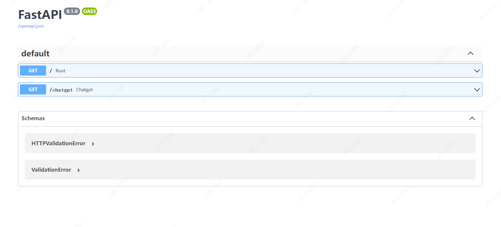

# chatGPT with fastAPI

Note: The idea is from https://github.com/wemio/chatGPTFlaskWebAPI

This a chatGPT API of azure openAI using python FastAPI, HTML,jquery.

## Introduction
This code implements any front-end web static page to call the python version of the chatGPT API, which is convenient for websites to integrate relevant applications into their own business.
The general requirement is this: I have a website, but in the area that chatGPT cannot access, I need to submit a local data request to the proxy server, get the answer, and complete the business logic.

## Question
Here's what happens when we call the azure openAI API:
1, The questions will wait a long time.
2, Unstable.
3, there is a danger of title.
4, can only be used locally, not remotely called.
5. There are various problems with PHP or other request versions.

## Method
1, python version of openAI installed, using the original module call, faster, better compatibility, and will not be blocked.
2, Use python modules such as flask to publish port web services.
3, Create a static web page by yourself. You can use html+jquery and eventSource to output stream information to the web page from the server.
4, Use stream mode to get openAI's data.

## Preparation
### install openai
> pip install openai
> 
> pip install fastapi
> 
> pip install sse_starlette

## Code

 The project is so simple, please see the detail code from main_fastapi.py.

## API

如果本地启动的项目， 可以通过http://10.190.129.107:5000/docs 查看 API.

## Usage
录制了屏幕截图，看看效果.

<video src="./assert/usage.mp4"></video>

